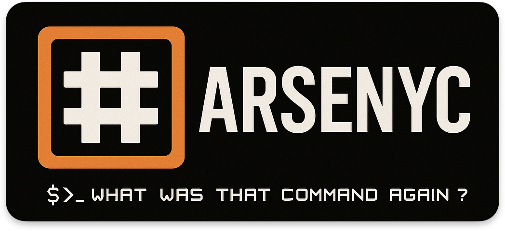

## 🧬 About

- **Name:** Sp00kySkelet0n
- **Whoami:** A student passionate about Offensive & Defensive security & DevOps/SelfHosting
- **Reach me:** sp00kySkeleton@protonmail.com

 
 

  

  

---

## 🌌 Featured Projects

### Arsenyc 

Arsenyc is a fork of the tool Arsenal by Orange but with added support of Notion synchronization so notion pages are converted to cheatsheets : [Arsenyc GITHUB](https://github.com/Sp00kySkelet0n/Arsenyc/tree/master)