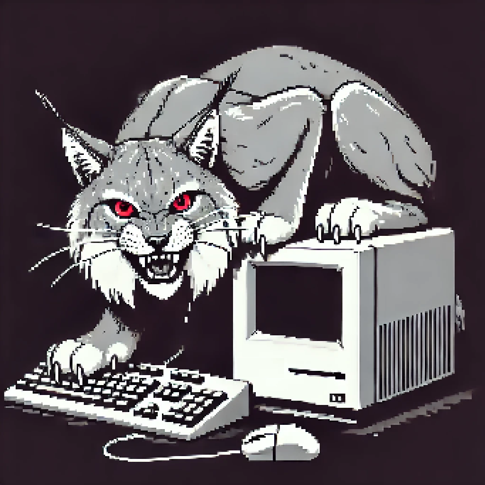
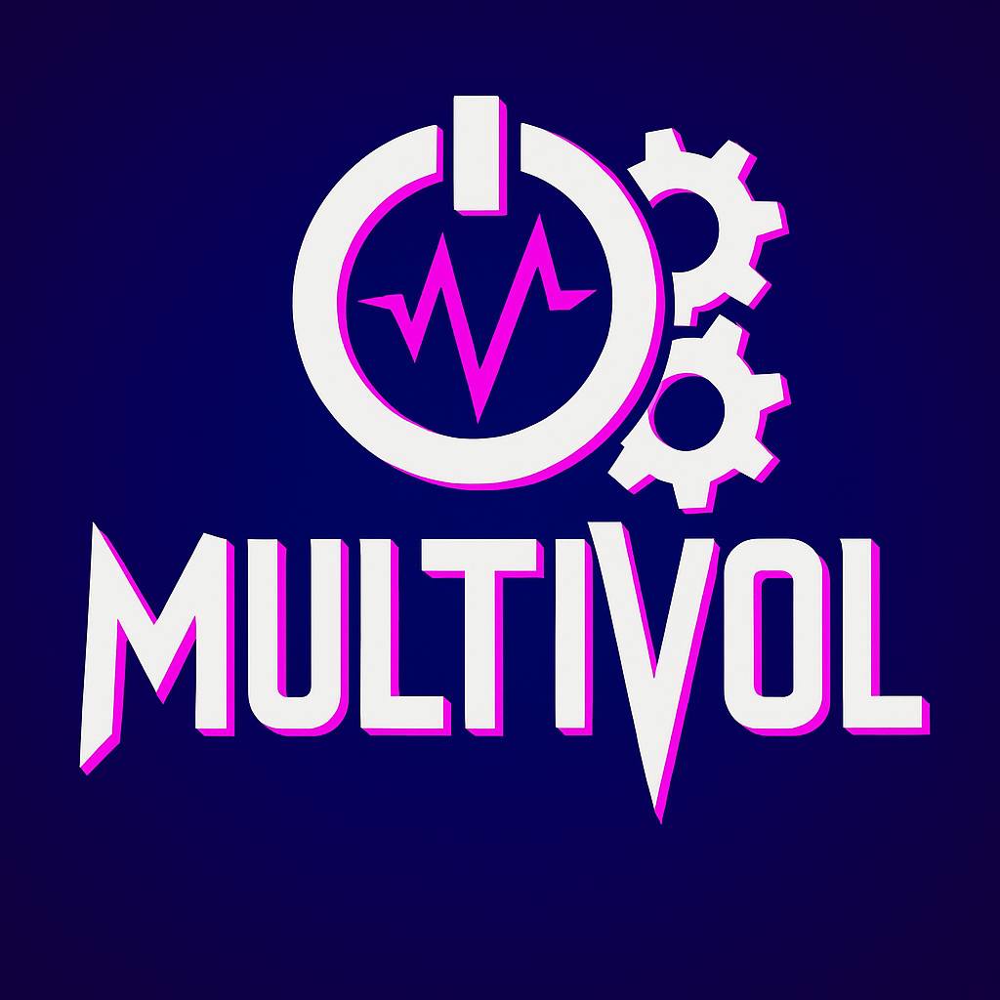

  
   
  <strong>Cybersecurity · DevOps · Self‑Hosting Enthusiast</strong>
    
  <a href="mailto:sp00kySkeleton@protonmail.com"><code>sp00kySkeleton@protonmail.com</code></a>

---

### Tech Stack

  
   
   
  

---

### GitHub Stats

  

---

### Featured Projects

<table>
  <tr>
    <td align="center" colspan="2">
      
      <h4>Arsenyc</h4>
      
Fork of Arsenal with Notion synchronization that turns your notes into terminal-ready cheat sheets.

    </td>
  </tr>
  <tr>
    <td align="center" width="50%">
      
      <h4>Lynks</h4>
      
Advanced C&amp;C malware PoC written in Nim over Tor with a Python Flask server and libcurl networking.

    </td>
    <td align="center" width="50%">
      
      <h4>MultiVol</h4>
      
A web interface for MultiVol, the volatility forensics analysis and automation tool.

    </td>
  </tr>
</table>
